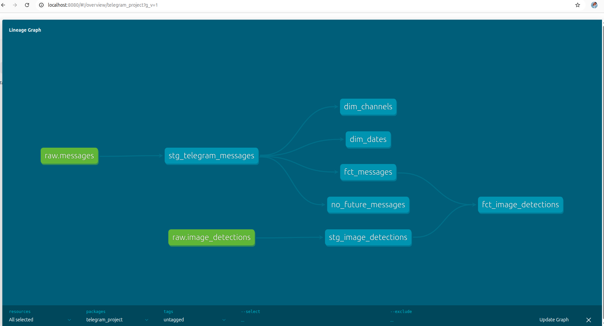
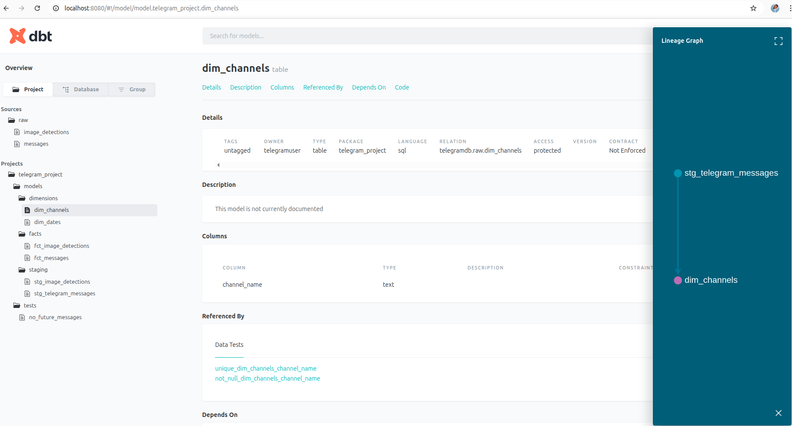
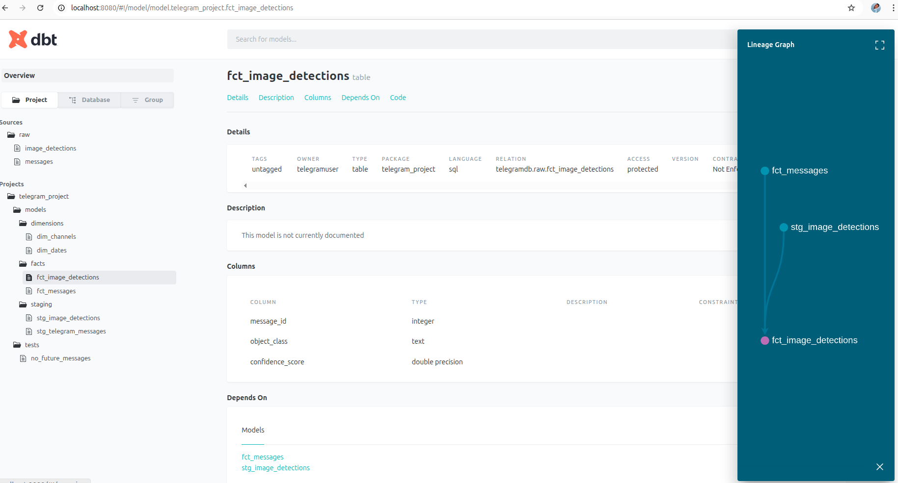
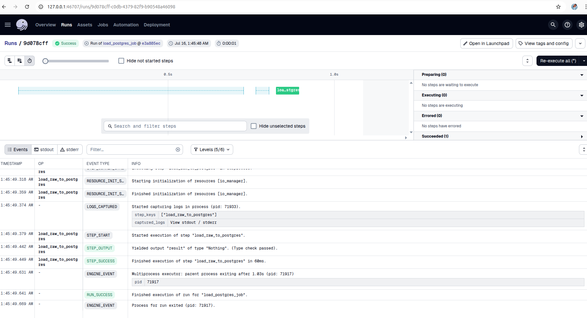
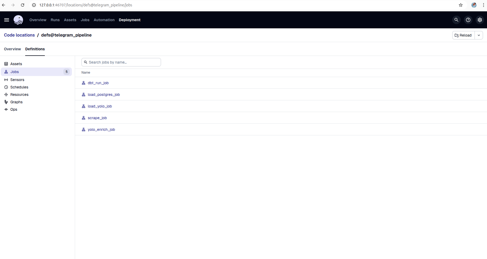

# Telegram Health Data Pipeline — Kara Solutions

## Overview
End-to-end pipeline for scraping, modeling, enriching, and serving Telegram data related to Ethiopian medical businesses.

## Tech Stack
- **Telethon**: Telegram scraping
- **PostgreSQL**: Data warehouse
- **dbt**: Transformation and modeling
- **YOLOv8 (Ultralytics)**: Object detection
- **FastAPI**: Analytical API
- **Dagster**: Pipeline orchestration
- **Docker**: Environment management
## Setup Instructions
### 1. Clone & Setup
```bash
git clone https://github.com/your-username/telegram-health-data-pipeline.git
cd telegram-health-data-pipeline
cp .env.example .env  
Great! Here's a complete and professional `README.md` for your project — covering all tasks from raw Telegram scraping to orchestration with Dagster:


#  Telegram Product Intelligence Pipeline (Kara Solutions)

A full-stack data pipeline that scrapes product-related messages from Telegram channels, extracts structured information, applies computer vision enrichment using YOLO, transforms data into an analytical star schema with dbt, and orchestrates the workflow using Dagster.


##  Overview

This project is designed to turn raw Telegram messages into actionable business insights through a robust data engineering workflow. It includes:


##  Project Structure

```

├── src/
│   ├── telegram_scraper.py         # Scrapes product messages from Telegram channels
│   ├── load_messages_to_postgres.py
│   ├── detect_objects.py           # YOLOv5 object detection on message images
│   └── load_image_detections_to_postgres.py
├── telegram_dbt/
│   └── telegram_project/           # dbt transformation project (staging + marts)
├── telegram_pipeline/             # Dagster project
│   ├── ops.py                      # Individual ops (scrape, load, enrich, dbt run)
│   ├── jobs.py                     # Jobs for each task (scrape_job, load_postgres_job, etc.)
│   ├── definitions.py              # Dagster repository definition
│   └── workspace.yaml              # Dagster workspace config
├── api/
│   └── main.py                     # FastAPI endpoint (Task 4 API service)
└── requirements.txt
```
```
---

##  Task Summary

###  Task 1: Telegram Scraping

* Scrapes messages from product-based Telegram channels using `telethon`.
* Stores raw JSON-like messages in memory or temporary files.

###  Task 2: Load to PostgreSQL

* Raw messages are parsed and loaded into PostgreSQL.
* Script: `load_messages_to_postgres.py`

###  Task 3: dbt Modeling

* dbt transforms raw messages into structured staging tables.
* Generates a star schema:

  * `dim_dates`
  * `dim_channel`
  * `fact_message`
* Includes built-in tests like:

  * `not_null`
  * `unique` on primary keys

###  Task 4: YOLO Image Enrichment + API

* Applies YOLOv5 object detection on product images.
* Loads results into PostgreSQL.
* Exposes FastAPI endpoints for predictions and analytics.

###  Task 5: Dagster Orchestration

* Each task is wrapped in a Dagster `@job`.
* Jobs:

  * `scrape_job`
  * `load_postgres_job`
  * `dbt_run_job`
  * `yolo_enrich_job`
  * `load_yolo_job`
* Manual, decoupled triggering of each job through Dagster UI.

---

##  Setup & Installation

1. **Clone & Setup**

   ```bash
   git clone https://github.com/NuryeNigusMekonen/Shipping-a-Data-Product-From-Raw-Telegram-Data-to-an-Analytical-API-Kara-Solutions.git
   cd Shipping-a-Data-Product-From-Raw-Telegram-Data-to-an-Analytical-API-Kara-Solutions
   python3 -m venv SD-venv
   source SD-venv/bin/activate
   pip install -r requirements.txt
   ```

2. **PostgreSQL Setup**

   * Start your PostgreSQL server
   * Create a DB: `telegram_db`
   * Update connection credentials in all ETL/dbt scripts and profiles.yml

3. **Run Individual Steps Manually**

   ```bash
   python3 src/telegram_scraper.py
   python3 load_messages_to_postgres.py
   dbt run --project-dir=telegram_dbt/telegram_project
   python3 detect_objects.py
   python3 load_image_detections_to_postgres.py
   ```

---

##  Dagster Usage (Task 5)

### Launch Dagster UI

```bash
cd telegram_pipeline
dagster dev -w workspace.yaml
```

### Trigger Jobs

* Visit [http://localhost:3000](http://localhost:3000)
* Select and run any job (manual/independent control):

  * `scrape_job`
  * `load_postgres_job`
  * `dbt_run_job`
  * `yolo_enrich_job`
  * `load_yolo_job`

---

##  FastAPI (Task 4 API)

```bash
uvicorn api.main:app --reload --host 0.0.0.0 --port 9000
```

Visit: [http://localhost:9000/docs](http://localhost:9000/docs)

---

##  Testing & Validation

* dbt tests: `dbt test`
* Dagster execution validation
* Manual inspection of enriched tables in PostgreSQL

---

##  Star Schema Diagram (Visual via dbt Docs)

To view your star schema:

```bash
cd telegram_dbt/telegram_project
dbt docs generate
dbt docs serve
```

Navigate to: [http://localhost:8000](http://localhost:8000) to see a visual DAG of models and lineage.

---
DBT


'

orchestration 



##  Final Notes

* Modular, testable, and scalable pipeline
* Each task runs independently
* Designed for real-time retail intelligence from Telegram channels

## Author 
Nurye Nigus +251929404324